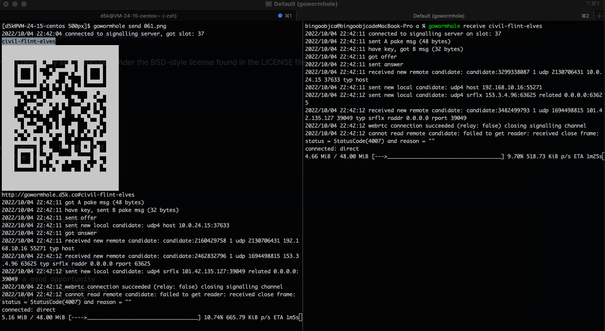
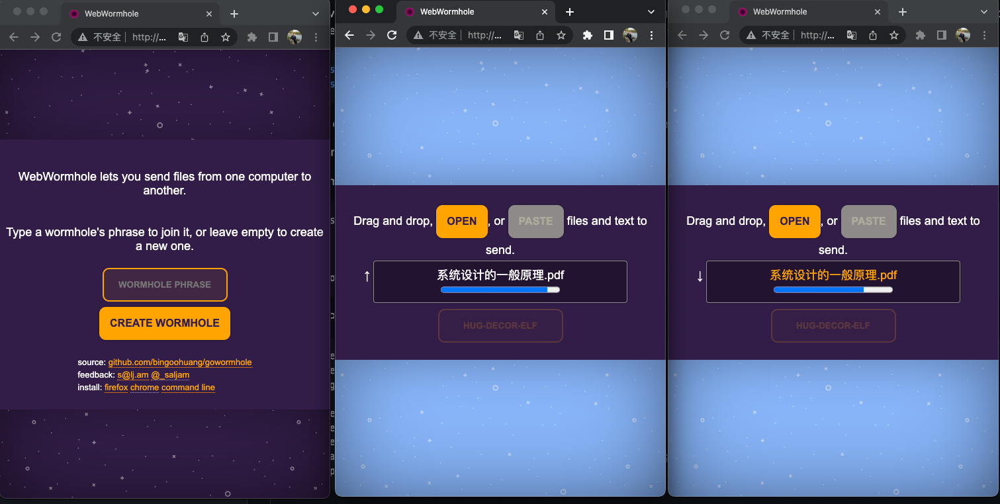

# gowormhole





THIS PROJECT IS STILL IN EARLY DEVELOPMENT IT USES EXPERIMENTAL
CRYPTOGRAPHIC LIBRARIES AND IT HAS NOT HAD ANY KIND OF SECURITY
OR CRYPTOGRAPHY REVIEW THIS SOFTWARE MIGHT BE BROKEN AND UNSAFE

	https://xkcd.com/949/

WebWormhole creates ephemeral pipes between computers to send files
or other data. Try it at https://webwormhole.io or on the command
line.

On one computer the tool generates a one-time code:

	$ cat hello.txt
	hello, world
	$ gowormhole send hello.txt
	east-pep-aloe

On another use the code to establish a connection:

	$ gowormhole receive east-pep-aloe
	$ cat hello.txt
	hello, world

To install the command line tool:

	$ go install github.com/bingoohuang/cmd/gowormhole@latest

To run the signalling server you need to compile the WebAssembly
files first.

	$ make wasm
	$ gowormhole server -https= -http=localhost:8000

To package the browser extension for Firefox or Chrome:

	$ make webwormhole-ext.zip

WebWormhole is inspired by and uses a model very similar to that
of Magic Wormhole.

	https://github.com/warner/magic-wormhole

It differs in that it uses WebRTC to make its connections. This
allows us to make use of WebRTC's NAT traversal tricks, as well as
the fact that it can be used in browsers. The exchange of session
descriptions (offers and answers) is protected by PAKE (we use
CPace) and a generated random password, similar to Magic Wormhole.
The session descriptions include the fingerprints of the DTLS
certificates that WebRTC uses to secure its communications.

The author operates the signalling server at webwormhole.io, its
alias wrmhl.link, and a relay server. These are free to use but
come with no SLAs or any guarantees of uptime. They facilitate
establishing connections between peers, but do not handle any
transferred data in cleartext.

The protocol does not need to trust the signalling server to maintain
the confidentiality of the files transferred. However, the convenience
of using the web client directly on webwormhole.io comes at the
cost of having to trust the code it serves. If the server is ever
compromised it can be used inject malicious code that undermines
the security of the client. To mitigate this, you can have more
control over which version of the client you run by using the command
line client or the browser extension. The extension is identical
to the web client, but packaged for Chrome and Firefox, loads no
remote code, and requires no permissions:

	https://addons.mozilla.org/firefox/addon/webwormhole/
	https://chrome.google.com/webstore/detail/jhombkhjanncdalcbcahinpjoacaiidn

Unless otherwise noted, the source files in this repository are
distributed under the BSD-style license found in the LICENSE file.

Frequently asked questions

Is it compatible with magic-wormhole?

	It is not. Maybe one day.

	This project started as a UI for magic-wormhole, but drifted
	away when I wanted to experiment with the PAKE used, the
	protocol, and the word lists.

Why CPace and not another PAKE algorithm?

	CPace and PAKE2 were the finalists for CFRG PAKE selection
	process (https://github.com/cfrg/pake-selection), so it was
	going to be one of the two.

	CPace (https://tools.ietf.org/id/draft-haase-cpace-01.html)
	looked nice and simple to implement, and there wasn't a
	CPace Go package at the time, so it was a good opportunity
	and a learning exercise to write one. I ended up nerd-sniping
	Filippo instead and he beat me to write filippo.io/cpace.

Why not the PGP word list?

	The PGP word list (https://en.wikipedia.org/wiki/PGP_word_list)
	is quite good as far as unambiguity goes. However, a few
	word combinations do make some unsavoury phrases. I switched
	to a word list that is more agreeable.

	Also, it would be nice to experiment with localised word
	lists.

Don't you have to trust the web server anyway? What's the point of
the PAKE?

	Yes and no. The application itself, because of the PAKE,
	does not need to trust the signalling server. You can install
	the command line tool, the browser extension, or host the
	web application's files yourself and not have to trust the
	signalling server at all. There's also a mobile app version
	in the works.

	The web version hosted on gowormhole.d5k.co exists as a middle
	ground between convenience and security. Like any other
	website you visit, you do have to trust it's not running
	any malicious code in your browser.

## resources

1. [Stunner](https://github.com/firefart/stunner) is a tool to test and exploit STUN, TURN and TURN over TCP servers.

    ```sh
    $ stunner info -s 127.0.0.1:3478
    INFO[0000] this server supports the STUN protocol
    INFO[0000] this server supports the TURN protocol with UDP transports
    INFO[0000] Attributes:
    INFO[0000] 	REALM: pion.ly
    INFO[0000] this server supports the TURN protocol with TCP transports
    INFO[0000] Attributes:
    INFO[0000] 	REALM: pion.ly
    ```

2. [WebRTC, WebRTC and WebRTC. Everything here is all about WebRTC!!](https://github.com/muaz-khan/WebRTC-Experiment)

    - FileBufferReader | File Sharing 
    - FileBufferReader is a JavaScript library reads file and returns chunkified array-buffers. The resulting buffers can be shared using WebRTC data channels or socket.io.
    - [Live Demo](https://www.webrtc-experiment.com/FileBufferReader/)
    - [Github (open-sourced)](https://github.com/muaz-khan/FileBufferReader)
    - [Youtube video presentation](https://www.youtube.com/watch?v=gv8xpdGdS4o)

3. [psanford/wormhole-william](https://github.com/psanford/wormhole-william), End-to-end encrypted file transfer. A magic wormhole CLI and API in Go (golang).
4. [pion/awesome-pion](https://github.com/pion/awesome-pion)
5. [sharef](https://github.com/bingoohuang/sharef)

## NAT behaviour discovery

`gowormhole nat`

-  WARNING: 2022/10/11 08:44:56 => NAT mapping behavior: address and port dependent
-  WARNING: 2022/10/11 08:45:03 => NAT filtering behavior: address and port dependent

```log
[root@fs01-192-168-126-182 bingoohuang]# gowormhole nat
 INFO: 2022/10/11 08:44:56 connecting to STUN server: stun.voip.blackberry.com:3478
 INFO: 2022/10/11 08:44:56 Local address: 0.0.0.0:58091
 INFO: 2022/10/11 08:44:56 Remote address: 206.53.19.13:3478
 INFO: 2022/10/11 08:44:56 Mapping Test I: Regular binding request
 INFO: 2022/10/11 08:44:56 Sending to 206.53.19.13:3478: (20 bytes)
 INFO: 2022/10/11 08:44:56 Response from 206.53.19.13:3478: (104 bytes)
 INFO: 2022/10/11 08:44:56 Received XOR-MAPPED-ADDRESS: 223.7.19.28:2221
 INFO: 2022/10/11 08:44:56 Mapping Test II: Send binding request to the other address but primary port
 INFO: 2022/10/11 08:44:56 Sending to 206.53.19.13:3478: (20 bytes)
 INFO: 2022/10/11 08:44:56 Response from 206.53.19.13:3478: (104 bytes)
 INFO: 2022/10/11 08:44:56 Received XOR-MAPPED-ADDRESS: 223.7.19.28:2498
 INFO: 2022/10/11 08:44:56 Mapping Test III: Send binding request to the other address and port
 INFO: 2022/10/11 08:44:56 Sending to 206.53.19.13:3479: (20 bytes)
 INFO: 2022/10/11 08:44:56 Response from 206.53.19.13:3479: (104 bytes)
 INFO: 2022/10/11 08:44:56 Received XOR-MAPPED-ADDRESS: 223.7.19.28:2499
 WARNING: 2022/10/11 08:44:56 => NAT mapping behavior: address and port dependent
 INFO: 2022/10/11 08:44:56 connecting to STUN server: stun.voip.blackberry.com:3478
 INFO: 2022/10/11 08:44:56 Local address: 0.0.0.0:60327
 INFO: 2022/10/11 08:44:56 Remote address: 206.53.19.13:3478
 INFO: 2022/10/11 08:44:56 Filtering Test I: Regular binding request
 INFO: 2022/10/11 08:44:56 Sending to 206.53.19.13:3478: (20 bytes)
 INFO: 2022/10/11 08:44:57 Response from 206.53.19.13:3478: (104 bytes)
 INFO: 2022/10/11 08:44:57 Filtering Test II: Request to change both IP and port
 INFO: 2022/10/11 08:44:57 Sending to 206.53.19.13:3478: (28 bytes)
 INFO: 2022/10/11 08:45:00 Timed out waiting for response from server 206.53.19.13:3478
 INFO: 2022/10/11 08:45:00 Filtering Test III: Request to change port only
 INFO: 2022/10/11 08:45:00 Sending to 206.53.19.13:3478: (28 bytes)
 INFO: 2022/10/11 08:45:03 Timed out waiting for response from server 206.53.19.13:3478
 WARNING: 2022/10/11 08:45:03 => NAT filtering behavior: address and port dependent
```

```log
[d5k@VM-24-15-centos ~]$ gowormhole nat
 INFO: 2022/10/11 08:47:27 connecting to STUN server: stun.voip.blackberry.com:3478
 INFO: 2022/10/11 08:47:28 Local address: 0.0.0.0:33542
 INFO: 2022/10/11 08:47:28 Remote address: 206.53.19.13:3478
 INFO: 2022/10/11 08:47:28 Mapping Test I: Regular binding request
 INFO: 2022/10/11 08:47:28 Sending to 206.53.19.13:3478: (20 bytes)
 INFO: 2022/10/11 08:47:28 Response from 206.53.19.13:3478: (104 bytes)
 INFO: 2022/10/11 08:47:28 Received XOR-MAPPED-ADDRESS: 101.42.13.12:33542
 INFO: 2022/10/11 08:47:28 Mapping Test II: Send binding request to the other address but primary port
 INFO: 2022/10/11 08:47:28 Sending to 206.53.19.13:3478: (20 bytes)
 INFO: 2022/10/11 08:47:28 Response from 206.53.19.13:3478: (104 bytes)
 INFO: 2022/10/11 08:47:28 Received XOR-MAPPED-ADDRESS: 101.42.13.12:33542
 WARNING: 2022/10/11 08:47:28 => NAT mapping behavior: endpoint independent
 INFO: 2022/10/11 08:47:28 connecting to STUN server: stun.voip.blackberry.com:3478
 INFO: 2022/10/11 08:47:28 Local address: 0.0.0.0:51783
 INFO: 2022/10/11 08:47:28 Remote address: 206.53.19.13:3478
 INFO: 2022/10/11 08:47:28 Filtering Test I: Regular binding request
 INFO: 2022/10/11 08:47:28 Sending to 206.53.19.13:3478: (20 bytes)
 INFO: 2022/10/11 08:47:29 Response from 206.53.19.13:3478: (104 bytes)
 INFO: 2022/10/11 08:47:29 Filtering Test II: Request to change both IP and port
 INFO: 2022/10/11 08:47:29 Sending to 206.53.19.13:3478: (28 bytes)
 INFO: 2022/10/11 08:47:32 Timed out waiting for response from server 206.53.19.13:3478
 INFO: 2022/10/11 08:47:32 Filtering Test III: Request to change port only
 INFO: 2022/10/11 08:47:32 Sending to 206.53.19.13:3478: (28 bytes)
 INFO: 2022/10/11 08:47:35 Timed out waiting for response from server 206.53.19.13:3478
 WARNING: 2022/10/11 08:47:35 => NAT filtering behavior: address and port dependent
[d5k@VM-24-15-centos ~]$
```

```
[root@192_168_16_4 ~]# gowormhole nat
 INFO: 2022/10/11 08:49:28 connecting to STUN server: stun.voip.blackberry.com:3478
 INFO: 2022/10/11 08:49:29 Local address: 0.0.0.0:41392
 INFO: 2022/10/11 08:49:29 Remote address: 206.53.19.13:3478
 INFO: 2022/10/11 08:49:29 Mapping Test I: Regular binding request
 INFO: 2022/10/11 08:49:29 Sending to 206.53.19.13:3478: (20 bytes)
 INFO: 2022/10/11 08:49:29 Response from 206.53.19.13:3478: (104 bytes)
 INFO: 2022/10/11 08:49:29 Received XOR-MAPPED-ADDRESS: 120.48.81.162:41392
 INFO: 2022/10/11 08:49:29 Mapping Test II: Send binding request to the other address but primary port
 INFO: 2022/10/11 08:49:29 Sending to 206.53.19.14:3478: (20 bytes)
 INFO: 2022/10/11 08:49:29 Response from 206.53.19.14:3478: (104 bytes)
 INFO: 2022/10/11 08:49:29 Received XOR-MAPPED-ADDRESS: 120.48.81.162:41392
 WARNING: 2022/10/11 08:49:29 => NAT mapping behavior: endpoint independent
 INFO: 2022/10/11 08:49:29 connecting to STUN server: stun.voip.blackberry.com:3478
 INFO: 2022/10/11 08:49:29 Local address: 0.0.0.0:39523
 INFO: 2022/10/11 08:49:29 Remote address: 206.53.19.13:3478
 INFO: 2022/10/11 08:49:29 Filtering Test I: Regular binding request
 INFO: 2022/10/11 08:49:29 Sending to 206.53.19.13:3478: (20 bytes)
 INFO: 2022/10/11 08:49:29 Response from 206.53.19.13:3478: (104 bytes)
 INFO: 2022/10/11 08:49:29 Filtering Test II: Request to change both IP and port
 INFO: 2022/10/11 08:49:29 Sending to 206.53.19.13:3478: (28 bytes)
 INFO: 2022/10/11 08:49:30 Response from 206.53.19.14:3479: (104 bytes)
 WARNING: 2022/10/11 08:49:30 => NAT filtering behavior: endpoint independent
 ```

## Inject error

注入环境变量：

1. INJECT_ERR_POS 注入位置
2. INJECT_ERR 注入错误信息

已支持注入位置:

1. RECV_START 在接受开始时

示例：

`INJECT_ERR_POS=RECV_START gowormhole recv debug-tint-limb`

## c-shared 接口

```go
// SendFiles 发送文件. 请求 JSON 字符串.
// e.g. {"code": "发送码", "files": ["1.jpg", "2.jpg"], "sync": false}
// code: 发送码，为空时，会生成新码
// files: 发送文件列表
// sync: 是否同步发送（当前调用阻塞，直到文件传输完成，或者发生错误）
//
//export SendFiles
func SendFiles(sendFileArgJSON string) (resultJSON string);

//export RecvFiles
func RecvFiles(argJSON string) (resultJSON string) {

```